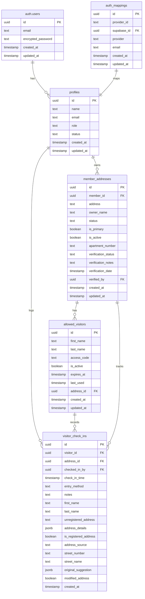

# Database Architecture Diagram

## Table Relationships

1. **auth.users** → **profiles**
   - One-to-many relationship
   - Each user can have one profile
   - Profile ID references user ID

2. **profiles** → **member_addresses**
   - One-to-many relationship
   - Each profile can have multiple addresses
   - Member ID references profile ID

3. **member_addresses** → **allowed_visitors**
   - One-to-many relationship
   - Each address can have multiple visitors
   - Address ID references member_addresses ID

4. **profiles** → **visitor_check_ins**
   - One-to-many relationship
   - Guards can log multiple check-ins
   - Checked_in_by references profile ID

5. **allowed_visitors** → **visitor_check_ins**
   - One-to-many relationship
   - Each visitor can have multiple check-ins
   - Visitor ID references allowed_visitors ID

6. **member_addresses** → **visitor_check_ins**
   - One-to-many relationship
   - Each address can have multiple check-ins
   - Address ID references member_addresses ID

7. **auth_mappings** → **profiles**
   - One-to-one relationship
   - Maps OAuth provider IDs to Supabase user IDs
   - Supabase ID references profile ID

## Key Features

1. **Row Level Security (RLS)**
   - All tables have RLS enabled
   - Policies control access based on user roles
   - Guards can only view approved addresses
   - Admins have full access
   - Members can only access their own data

2. **Audit Trail**
   - All tables include created_at/updated_at timestamps
   - Visitor check-ins track all access attempts
   - Verification status tracking for addresses
   - Access logs with detailed information

3. **Data Integrity**
   - Foreign key constraints ensure referential integrity
   - Check constraints on status fields
   - Unique constraints on provider mappings
   - Validation for address and visitor data

4. **Performance**
   - Indexes on frequently queried fields
   - Views for common report queries
   - Optimized for common access patterns
   - Efficient visitor lookup by access code

5. **Security Features**
   - Role-based access control
   - Address verification system
   - Visitor expiration management
   - Access code validation
   - OAuth provider integration

6. **Flexibility**
   - Support for multiple addresses per member
   - Primary address designation
   - Apartment number support
   - Unregistered address handling
   - Multiple entry methods 